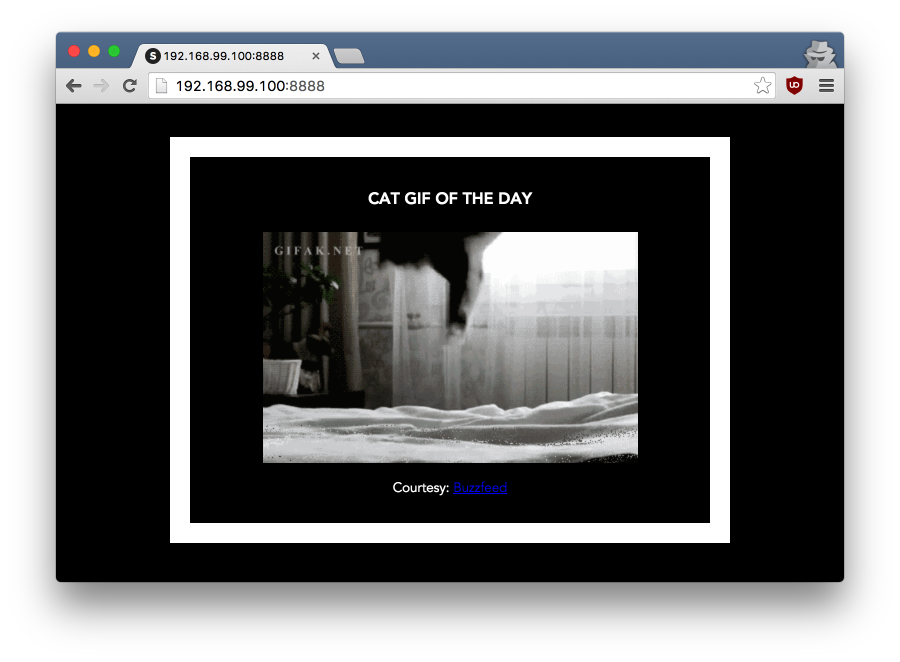

## 3.0 Deploying an app to a Swarm
This portion of the tutorial will guide you through deploying the Flask application we made to Heroku using Docker.

**Important.**
To complete this section, you will need to have Docker installed on your machine as mentioned in the [Setup](./setup.md) section. You'll also need to have a Heroku account, which you can get [here](https://signup.heroku.com/) if you don't have one.

### What is Heroku?
Heroku is a simple cloud hosting platform. Their service makes it easy to publish your applications on the web without having to create and manage your own web server.  It relies on Amazon Web Services (AWS) infrastructure and works well with Docker!  There's even a limited free account which you can use for this tutorial.

Start by `cd`ing into the directory containing your application.  

### 3.1 Installing the Heroku Container Registery plugin

>**Note:** We're going to use the Heroku CLI to deploy this application.  Make sure you sign up for [a free Heroku account](https://signup.heroku.com/) and install the CLI by [folowing these instructions](https://devcenter.heroku.com/articles/heroku-cli).

Heroku created a handy plugin for working with Docker Containers. Set it up by running the following commands:

```
heroku plugins:install heroku-container-registry
heroku container:login
```

### 3.2 Creating & Deploying your Heroku App

Before we can deploy to Heroku we need to create a new Heroku application. We can easily create one from the command line by running the following command:

```
$ heroku create
Creating ⬢ alpine-spring-40138... done
https://alpine-spring-40138.herokuapp.com/ | https://git.heroku.com/alpine-spring-40138.git
```

Check out the `APP NAME` printed out by the Heroku CLI.  Heroku programatically generates a random application name if you didn't specify one. You will need to reference the application name you see in the next step.

Now we can use the Heroku `container:push` command to build and publish our Docker image on the app we just created.

```
$ heroku container:push web --app alpine-spring-40138
Sending build context to Docker daemon 7.168 kB
Step 1/8 : FROM alpine:3.5
 ---> 88e169ea8f46
Step 2/8 : RUN apk add --update py2-pip
 ---> Using cache
 ---> 092f0d63efa5
Step 3/8 : COPY requirements.txt /usr/src/app/
 ---> Using cache
 ---> 6698c1620af9
Step 4/8 : RUN pip install --no-cache-dir -r /usr/src/app/requirements.txt
 ---> Using cache
 ---> afceb4b3f826
Step 5/8 : COPY app.py /usr/src/app/
 ---> Using cache
 ---> 8e10ed2a8508
Step 6/8 : COPY templates/index.html /usr/src/app/templates/
 ---> Using cache
 ---> 8d95e94c579b
Step 7/8 : ONBUILD expose $PORT
 ---> Using cache
 ---> 5274cb1424b4
Step 8/8 : CMD python /usr/src/app/app.py
 ---> Using cache
 ---> 669c54469bb9
Successfully built 669c54469bb9
The push refers to a repository [registry.heroku.com/alpine-spring-40138/web]
efa6c37d0ae8: Layer already exists
779aa7159987: Layer already exists
b9fb8f60d4f6: Layer already exists
a6d6947400ab: Layer already exists
1f8090c7aa46: Layer already exists
60ab55d3379d: Layer already exists
latest: digest: sha256:586d3dc53099e7a861786bbbdf4d4e5f8a5dc90d55c30669235af8716c5cfec9 size: 1572
```
### 3.3 View your Live Website!

Congrats! You just deployed your first Docker Image to the Internet.  To view it in your browser, just run the following (substituting in your Heroku application's name):

```
$ heroku open --app alpine-spring-40138
Opening app... https://alpine-spring-40138.herokuapp.com/
```
You should see the Flask app we made early, but now available on the web for you to share with your friends!



Hit the Refresh button in the web browser to see a few more cat images.

### 3.4 Next steps
Now that you've built some images and pushed them to the wbe, you can explore more of Docker by checking out [the documentation](https://docs.docker.com). And if you need any help, check out the [Docker Forums](forums.docker.com) or [StackOverflow](https://stackoverflow.com/tags/docker/).
